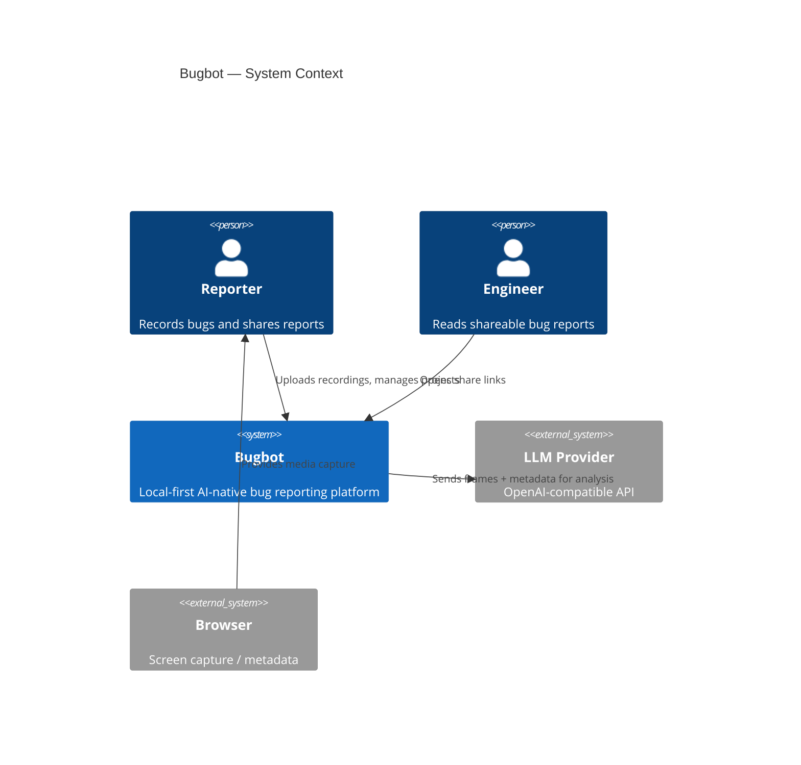
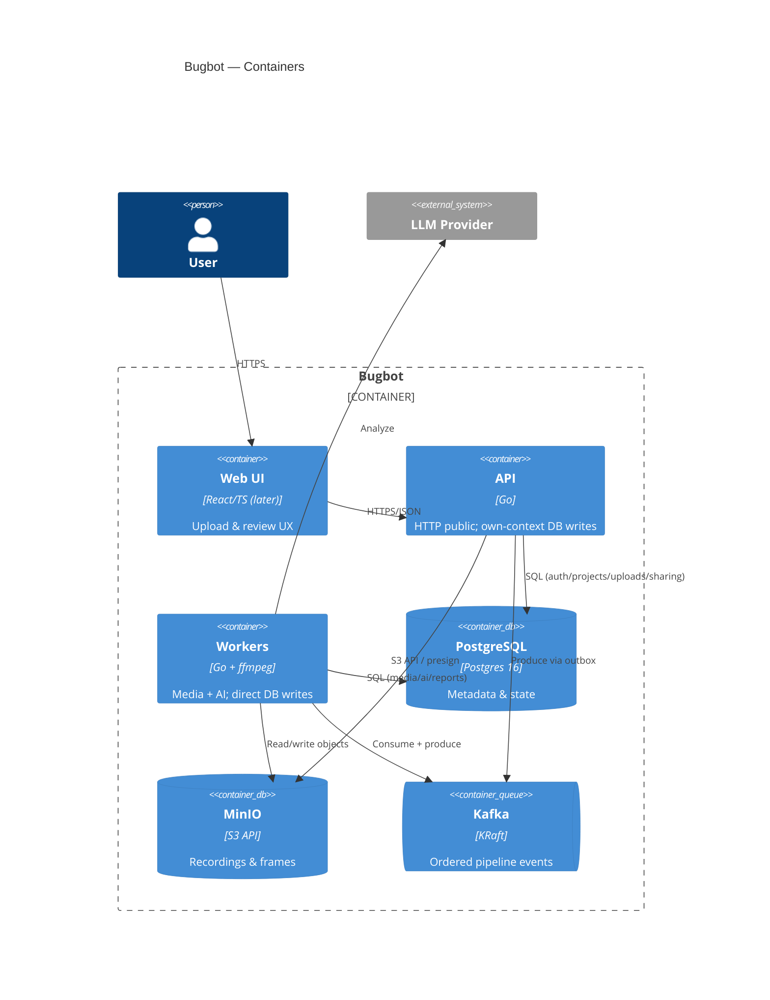
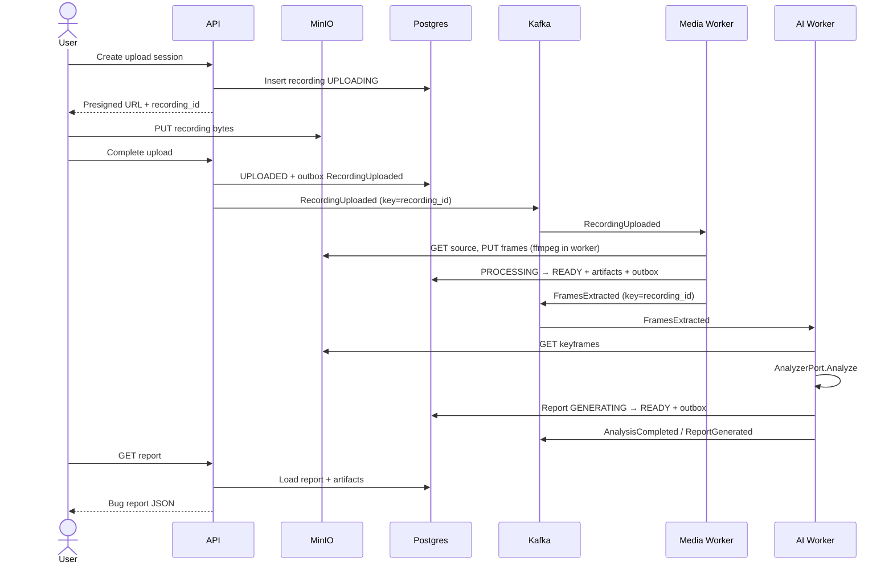
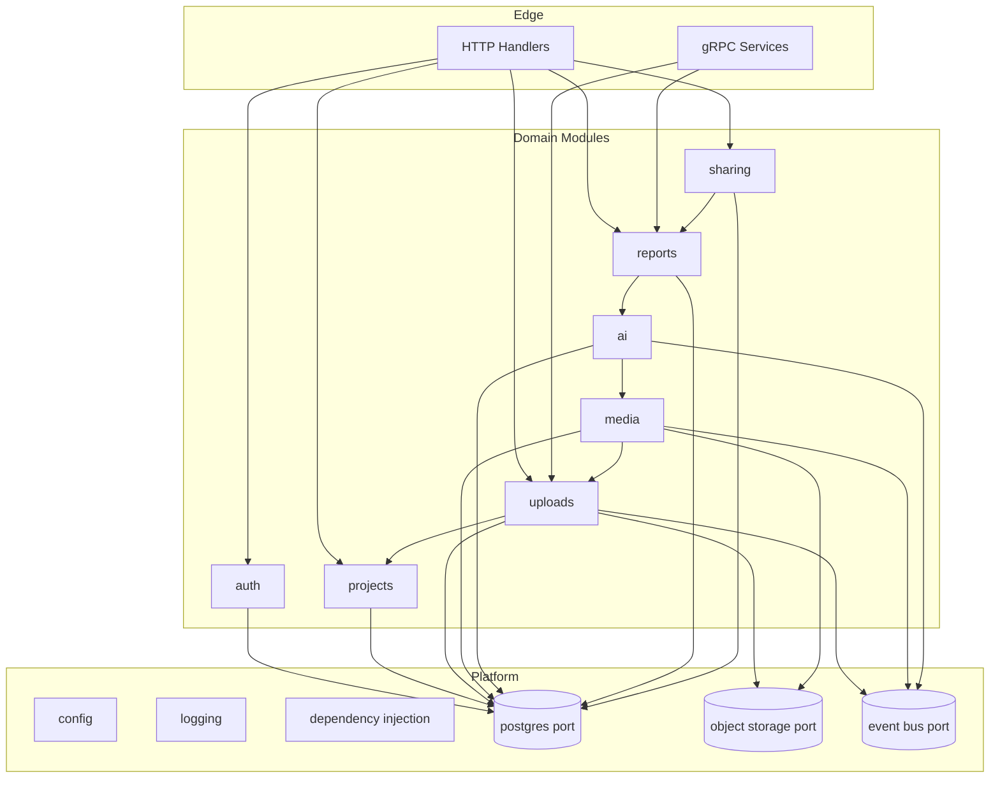
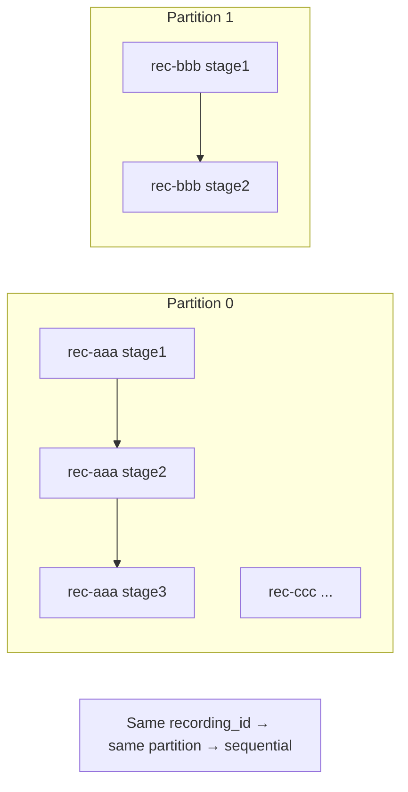

# Architecture Diagrams

## System Context (C4 — Level 1)

```mermaid
C4Context
    title Bugbot — System Context

    Person(reporter, "Reporter", "Records bugs and shares reports")
    Person(engineer, "Engineer", "Reads shareable bug reports")

    System(bugbot, "Bugbot", "Local-first AI-native bug reporting platform")

    System_Ext(llm, "LLM Provider", "OpenAI-compatible API")
    System_Ext(browser, "Browser", "Screen capture / metadata")

    Rel(reporter, bugbot, "Uploads recordings, manages projects")
    Rel(engineer, bugbot, "Opens share links")
    Rel(bugbot, llm, "Sends frames + metadata for analysis")
    Rel(browser, reporter, "Provides media capture")
```

## Container View (C4 — Level 2)

```mermaid
C4Container
    title Bugbot — Containers

    Person(user, "User")

    Container_Boundary(bugbot, "Bugbot") {
        Container(web, "Web UI", "React/TS (later)", "Upload & review UX")
        Container(api, "API", "Go", "HTTP public; own-context DB writes")
        Container(worker, "Workers", "Go + ffmpeg", "Media + AI; direct DB writes")
        ContainerDb(pg, "PostgreSQL", "Postgres 16", "Metadata & state")
        ContainerDb(minio, "MinIO", "S3 API", "Recordings & frames")
        ContainerQueue(kafka, "Kafka", "KRaft", "Ordered pipeline events")
    }

    System_Ext(llm, "LLM Provider")

    Rel(user, web, "HTTPS")
    Rel(web, api, "HTTPS/JSON")
    Rel(api, pg, "SQL (auth/projects/uploads/sharing)")
    Rel(api, minio, "S3 API / presign")
    Rel(api, kafka, "Produce via outbox")
    Rel(worker, kafka, "Consume + produce")
    Rel(worker, minio, "Read/write objects")
    Rel(worker, pg, "SQL (media/ai/reports)")
    Rel(worker, llm, "Analyze")
```

## Pipeline Sequence

```mermaid
sequenceDiagram
    actor U as User
    participant API as API
    participant S3 as MinIO
    participant DB as Postgres
    participant K as Kafka
    participant M as Media Worker
    participant A as AI Worker

    U->>API: Create upload session
    API->>DB: Insert recording UPLOADING
    API-->>U: Presigned URL + recording_id
    U->>S3: PUT recording bytes
    U->>API: Complete upload
    API->>DB: UPLOADED + outbox RecordingUploaded
    API->>K: RecordingUploaded (key=recording_id)

    K->>M: RecordingUploaded
    M->>S3: GET source, PUT frames (ffmpeg in worker)
    M->>DB: PROCESSING → READY + artifacts + outbox
    M->>K: FramesExtracted (key=recording_id)

    K->>A: FramesExtracted
    A->>S3: GET keyframes
    A->>A: AnalyzerPort.Analyze
    A->>DB: Report GENERATING → READY + outbox
    A->>K: AnalysisCompleted / ReportGenerated

    U->>API: GET report
    API->>DB: Load report + artifacts
    API-->>U: Bug report JSON
```

## Module Dependency (Monolith)

```mermaid
flowchart TB
    subgraph edge [Edge]
        HTTP[HTTP Handlers]
        GRPC[gRPC Services]
    end

    subgraph domain [Domain Modules]
        Auth[auth]
        Projects[projects]
        Uploads[uploads]
        Media[media]
        AI[ai]
        Reports[reports]
        Sharing[sharing]
    end

    subgraph platform [Platform]
        Config[config]
        Log[logging]
        DI[dependency injection]
        DB[(postgres port)]
        Obj[(object storage port)]
        Bus[(event bus port)]
    end

    HTTP --> Auth
    HTTP --> Projects
    HTTP --> Uploads
    HTTP --> Reports
    HTTP --> Sharing
    GRPC --> Reports
    GRPC --> Uploads

    Uploads --> Projects
    Media --> Uploads
    AI --> Media
    Reports --> AI
    Sharing --> Reports

    Auth --> DB
    Projects --> DB
    Uploads --> DB
    Uploads --> Obj
    Uploads --> Bus
    Media --> Obj
    Media --> Bus
    Media --> DB
    AI --> Bus
    AI --> DB
    Reports --> DB
    Sharing --> DB
```

## Ordering Model

```mermaid
flowchart LR
    subgraph P0 [Partition 0]
        R1[rec-aaa stage1] --> R1b[rec-aaa stage2] --> R1c[rec-aaa stage3]
        R3[rec-ccc ...]
    end

    subgraph P1 [Partition 1]
        R2[rec-bbb stage1] --> R2b[rec-bbb stage2]
    end

    note1[Same recording_id → same partition → sequential]
```
